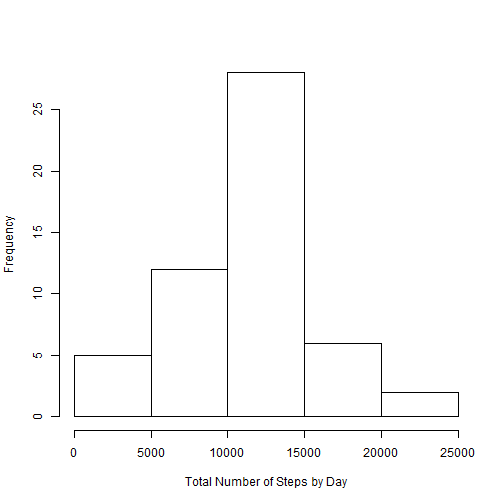
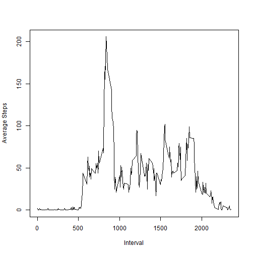
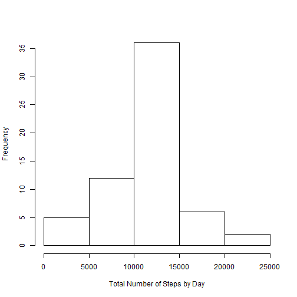
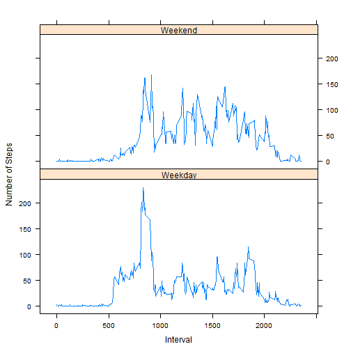

## Loading and preprocessing the data
For this analysis, the data is downloaded from its web repository and then aggregated by date and by interval, with missing data removed for the initial analysis.

```r
setInternet2(use = TRUE)
fileUrl <- "https://d396qusza40orc.cloudfront.net/repdata%2Fdata%2Factivity.zip"
if (!file.exists("./repdata_data_activity.zip")) {
    download.file(fileUrl, destfile = "./repdata_data_activity.zip")
    unzip("./repdata_data_activity.zip")
}
activity <- read.csv("activity.csv")
totalbydate <- with(activity, aggregate(steps ~ date, FUN = sum, na.rm = TRUE))
avgbyinterval <- with(activity, aggregate(steps ~ interval, FUN = mean, na.rm = TRUE))
avgbyinterval$steps <- round(avgbyinterval$steps, 0)
```


## What is mean total number of steps taken per day?
Here is a histogram of the number of steps taken each day:

```r
hist(totalbydate$steps, xlab = "Total Number of Steps by Day", main = NULL)
```

 

```r
meansteps <- as.integer(mean(totalbydate$steps))
mediansteps <- median(totalbydate$steps)
```
The mean total number of steps taken each day is 10766 and the median is 10765.


## What is the average daily activity pattern?
Here is a plot of the average number of steps taken by interval, averaged across all days:

```r
with(avgbyinterval, plot(interval, steps, type = "l", xlab = "Interval", ylab = "Average Steps"))
```

 

```r
maxinterval <- avgbyinterval$interval[avgbyinterval$steps==max(avgbyinterval$steps)]
```
The 5-minute interval which contains the maximum number of steps, on average across all the days in the dataset, is interval 835.


## Imputing missing values

```r
missingvalues <- with(activity, sum(is.na(steps)))
```
The number of missing values in the dataset is 2304.  To determine if the missing values introduced a bias into the analysis, I've created a new dataset and imputed the missing values from the original data set.  The strategy for filling those missing values is to use the average number of steps for the corresponding interval.

```r
# Define new data set and replace missing values with average steps for the same interval
imp_activity <- activity
imp_activity$imp_steps <- avgbyinterval$steps[match(imp_activity$interval,avgbyinterval$interval)]
imp_activity$steps[is.na(imp_activity$steps)] <- imp_activity$imp_steps[is.na(imp_activity$steps)]
imp_totalbydate <- with(imp_activity, aggregate(steps ~ date, FUN = sum, na.rm = TRUE))
```
Here is a histogram of the number of steps taken each day, using the dataset with imputed missing values:

```r
hist(imp_totalbydate$steps, xlab = "Total Number of Steps by Day", main = NULL)
```

 

```r
imp_meansteps <- as.integer(mean(imp_totalbydate$steps))
imp_mediansteps <- as.integer(median(imp_totalbydate$steps))
```
Using the dataset with imputed missing values, the mean total number of steps taken each day is 10765 (compared to 10766 in the orignal dataset) and the median is 10762 (compared to 10765 in the orignal dataset).  Based on those comparisons, the missing data does not introduce a bias.


## Are there differences in activity patterns between weekdays and weekends?
Using the dataset with imputed values for the missing data, new variables are added to determine if the dates fell on weekdays (Monday through Friday) or weekends (Saturday and Sunday).

```r
imp_activity$day <- weekdays(as.Date(imp_activity$date))
imp_activity$daytype <- "Weekday"
imp_activity$daytype[imp_activity$day %in% c("Saturday", "Sunday")] <- "Weekend"
imp_avgbyinterval <- with(imp_activity, aggregate(steps ~ interval + daytype, FUN = mean, na.rm = TRUE))
imp_avgbyinterval$steps <- round(imp_avgbyinterval$steps, 0)
```
Here is a time series plot of the 5-minute interval and the average number of steps taken, averaged across all weekday days or weekend days:

```r
library(lattice)
xyplot(steps ~ interval | daytype, data = imp_avgbyinterval, type = "l", layout = c(1,2), xlab = "Interval", ylab = "Number of Steps")
```

 

```r
# end plot
```
It appears that activity patterns peak at a higher level on weekdays, but weekends have a higher average level of activity for the majority of the day.
